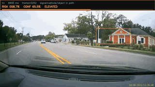
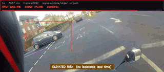

# Incident case studies

Two segments from public YouTube uploads, used for educational research demonstration. Frame-labeled proof video. Human review required. Not a benchmark. Source detail: [SOURCE.md](SOURCE.md).

Timings match the labels burned into each proof export at container FPS.

## Dashcam T-bone (ViralHog) (`FD1sacdeW8E`)

Conflict **32.50 s** | duration **38.53 s** | peak risk **0.96** | advance ~**0.6 s** (moderate)

**Footage:** Vehicle enters from the side for a T-bone style impact near 32.5 s.

**Output:** Risk crosses moderate band ~0.6 s before conflict. Phases: pre_conflict 31.9 to 32.5 s, conflict 32.5 s, post_impact 32.5 to 38.5 s.

<video controls width="854" poster="https://cdn.jsdelivr.net/gh/ruddro-roy/road-risk-review-case-studies@main/case-studies/FD1sacdeW8E/proof_poster.jpg" src="https://cdn.jsdelivr.net/gh/ruddro-roy/road-risk-review-case-studies@main/case-studies/FD1sacdeW8E/detection_proof.mp4"></video>

Poster: [proof_poster.jpg](case-studies/FD1sacdeW8E/proof_poster.jpg) | Timeline: [00_risk_timeline.png](case-studies/FD1sacdeW8E/00_risk_timeline.png) | Review: [investigation_review.md](case-studies/FD1sacdeW8E/investigation_review.md)

Full resolution: [detection_proof_hd.mp4](case-studies/FD1sacdeW8E/detection_proof_hd.mp4)

Source (context): https://www.youtube.com/watch?v=FD1sacdeW8E

## Motorbike low-side (helmet-mounted camera) (`PB5bNj3dzEk`)

Conflict **8.47 s** | duration **10.90 s** | peak risk **0.97**

**Footage:** Low-side loss of control with peak motion near 8.5 s.

**Output:** No isolatable advance-warning lead time. Imminent window 6.47 to 8.47 s. Phases: pre_conflict 1.0 to 8.47 s, conflict 8.47 s, post_impact 8.47 to 10.87 s.

<video controls width="854" poster="https://cdn.jsdelivr.net/gh/ruddro-roy/road-risk-review-case-studies@main/case-studies/PB5bNj3dzEk/proof_poster.jpg" src="https://cdn.jsdelivr.net/gh/ruddro-roy/road-risk-review-case-studies@main/case-studies/PB5bNj3dzEk/detection_proof.mp4"></video>

Poster: [proof_poster.jpg](case-studies/PB5bNj3dzEk/proof_poster.jpg) | Timeline: [00_risk_timeline.png](case-studies/PB5bNj3dzEk/00_risk_timeline.png) | Review: [investigation_review.md](case-studies/PB5bNj3dzEk/investigation_review.md)

Full resolution: [detection_proof_hd.mp4](case-studies/PB5bNj3dzEk/detection_proof_hd.mp4)

Source (context): https://www.youtube.com/watch?v=PB5bNj3dzEk

## Limits

[limitations.md](limitations.md)
